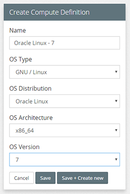

# Compute Definitions
Central to MyST is the Platform Blueprint which defines an environment agnostic topology/configuration and provides an abstraction layer over the underlying infrastructure.
This allows us to define a standardized topology, which we can use to provision equivalent middleware platforms across bare metal, virtual machines and public cloud.

When, we create a Platform Blueprint, we need to specify its Compute Definition. This is used to define the operating system requirements for target servers (i.e Virtual or Bare Metal) that will be used by any Platform Model based on the Platform Blueprint.

The Compute Definition specifies the following details about the host operating system:
 * **Type** - The operating system type, for example Linux, Solaris.
 * **Distribution** - The operating system distribution, for example Oracle Linux, RedHat Linux.
 * **Architecture** - The chip architecture for the operating system, for example  x86-64.
 * **Version** - The version of the operating system, for example Oracle Linux 6.

### Use of Compute Definitions for Pre-Existing Infrastructure
When adding a target host to a Pre-Existing Infrastructure Provider, we need to specify its compute definition.

When we create a Platform Model to provision a middleware platform to Pre-Existing Infrastructure, one of the steps is to map the target hosts to the model. Only those target hosts which have the same Compute Definition as the Platform Blueprint are available to be assigned to the Platform Model.

### Use of Compute Definitions for AWS On-Demand Infrastructure
When creating a Platform Model for AWS On-Demand, then the Compute Definition is used to map to the Amazon Machine Image (AMI) to be used when creating the Amazon EC2 instances on demand. 

## List Compute Definitions
To see a list of defined Compute Definitions, click  `Infrastructure` > `Compute Definitions`. This will display a list similar to the one below.

## Creating a New Compute Definition
Click `+ Create New`, this will open the **Add Compute Definition** dialogue. Specify the 

 * **Name** - Name of your compute definition.
 * **OS Type** - The operating system type that you want as part of your compute definition.
 * **OS Distribution** - Select the operating system of your compute definition.
 * **OS Architecture** - Select the operating system architecture of your compute definition.
 * **OS Version** - Select the version of the operating system for your compute definition.

Click `Save` to create the new Compute Definition. You can also click `Save + Create New` to immediately create a new compute definition after saving the current one.

## Edit Compute Definition
To edit the Compute Definition; click on the `Edit` button for the corresponding Compute Definition, this will open the **Edit Compute Definition** dialogue.

Here you can modify the Name of the Compute Definition.

## Activate / Deactivate Compute Definition
By default, when you create a Compute Definition, it is in an active state. Meaning we can create Platform Blueprints, Models and Target Hosts that reference that Compute Definition.

To prevent any new Blueprints / Models reference a Compute Definition, we can deactivate the reference that Compute Definition.

You can deactivate a compute definition if you no longer want to use it as part of your infrastructure definitions, which will prevent it from being used in any new Platform Blueprints / Models and Target Hosts.

**Note**: 
* Deactivating a Compute Definition does not affect resources that already reference that Compute Definition.
* A deactivated Compute Definition can be reactivated at any time.

To deactivate a Compute Definition; click on the  **Actions** drop-down menu for the corresponding Compute Definition and select `Deactivate` as illustrated below.

To activate a deactivated Compute Definition; click on the  **Actions** drop-down menu for the corresponding Compute Definition and select `Activate`.