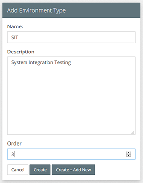

# Environment Types
During the lifetime of a project, code will be built and promoted to various staging environments, such as Development (DEV), System Integration Testing (SIT), User Acceptance Testing (UAT), Pre-Production (PRE), and Production (PROD).

Each of these environments is aligned with different stages of the Software Development Lifecycle (SDLC) and is intended for a specific purpose, for example:
* ** DEV** - Used by developers to develop and unit test there code prior to checking into source control. 
* **BLD / CI ** - Build environment, where committed code is built and unit testing is performed.
* **SIT** - Used to test a system's integration points with  other systems.
* **UAT**-  Business stakeholders test the system against their  business requirements
* **PRE** - Used to test the deployment process, prior to release into production.
* **PROD** - Production environment, where systems finally get deployed to.

For each environment, we need to be able to control who has access to it, and what type of actions they can perform against the environment, for example:

* Who can (re-)provision a platform instance?
* Who is allowed to perform platform configuration changes?
* Who is able to stop/start a platform instance?
* Who is able to deploy / promote code into an environment?

Within MYST we can define Environment Types. 
* Any MyST resource that is environment specific, such as a Platform Model, Platform Instance or Application Model is tagged to an Environment Type, this in conjunction with Role Based Access Control (RBAC) allows us to control who can perform which actions in which environment.

* Environment Types are also used to specify which environments and in which order applications should be promoted through on its journey to production.

## List Environment Types
To see a list of defined Environment Types, click  `Infrastructure` > `Environment Types`. This will display a list similar to the one below.

## Creating a New environment type
Click `+ Create New`, this will open the **Add Environment Type** dialogue. Specify the 

* **Name** - Short hand name for the Environment, such as SIT, UAT or PROD
* **Description** - A longer description of the environment (e.g. System Integration Test)
* **Order** - Used to specify the order in which code is deployed in the SDLC

Define all the environment types that you want to use in your platform settings. After you define your environment types, you can tag hosts to the environment types. When you build your platform model for an environment, only the hosts tagged to the specific environment show in the list, which you can map to your nodes.

The environment types in your list can be activated or deactivated. Only the active environment types are displayed in the Infrastructure Provider and the Platform Model. Deactivating an existing environment type does not affect the models and infrastructure providers that are currently mapped to the environment type.

Every new environment type that you add is in the active state by default. To deactivate an active environment type, click **Actions > Deactivate**. To activate a deactivated environment type, click **Actions > Activate**.

## Creating a new environment type
The following steps describe how to create a new environment type.

1. To create a new environment type, click **Create New** on the environment types screen.
2. Add a name and description for your environment type.
3. Click **Add** to add the environment type.