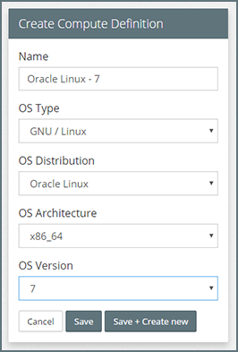

## {{ page.title }}

Compute Definitions are used to indicate operating system requirements for target hosts in MyST Studio. When we create a Platform Blueprint, we need to specify its Compute Definition. This is used to define the operating system requirements for target servers \(i.e Virtual or Bare Metal\) that will be used by any Platform Model based on the Platform Blueprint.

When provisioning Platform Instances from a Blueprint on pre-existing target hosts, the Compute Definition tells MyST how it should interact with target hosts. For example, if the Compute Definition is for Solaris then MyST will know to treat the platform as if it is Solaris instead of, say, Oracle Linux.

The Compute Definition specifies the following details about the host operating system:

* **Type** - The operating system type, for example Linux, Solaris.
* **Distribution** - The operating system distribution, for example Oracle Linux, RedHat Linux.
* **OS Architecture** - The chip architecture for the operating system, for example x86-64.
* **OS Version** - The version of the operating system, for example Oracle Linux 6.

### Use of Compute Definitions for Pre-Existing Infrastructure

When adding a target host to a Pre-Existing Infrastructure Provider, we need to specify its compute definition.

When we create a Platform Model to provision a middleware platform to Pre-Existing Infrastructure, one of the steps is to map the target hosts to the model. Only those target hosts which have the same Compute Definition as the Platform Blueprint are available to be assigned to the Platform Model. This feature prevents provisioning and deployment to incompatible target environments. For example, we should not be able to deploy a Platform Blueprint optimised for Solaris to a Linux target host, or vice versa, as it may lead to unintended runtime consequences.

### Use of Compute Definitions for AWS On-Demand Infrastructure

When creating a Platform Model for AWS On-Demand, then the Compute Definition is used to map to the Amazon Machine Image \(AMI\). The AMI is a Machine Image that is used to create the Amazon EC2 instances on demand at provisioning time.

<!-- TODO: Describe how to create the AMI machine image. See 2.5. Middleware Hosts -->

### List Compute Definitions

To see a list of defined Compute Definitions, click `Infrastructure` &gt; `Compute Definitions`. This will display a list similar to the one below.

### Creating a New Compute Definition

Click `+ Create New`, this will open the **Create Compute Definition** dialogue. Specify the...

* **Name** - Name of your compute definition. This is what you see when you reference it in a Platform Blueprint or Host.
* **OS Type** - The operating system type that you want as part of your compute definition.
* **OS Distribution** - The operating system distribution of your compute definition.
* **OS Architecture** - The operating system architecture of your compute definition.
* **OS Version** -The version of the operating system for your compute definition.

Click `Save` to create the new Compute Definition. You can also click `Save + Create New` to immediately create a new compute definition after saving the current one.

TIP: It is common for all target hosts across an Oracle Middleware landscape to be on the same operating system distribution and version. In this case, we would only ever need to define one Compute Definition.

### Edit Compute Definition

To edit the Compute Definition, click on the `Edit` button for the corresponding Compute Definition. This will open the **Edit Compute Definition** dialogue.

Here you can modify the Name of the Compute Definition. Remember, the Name of the Compute Definition is what you see when you reference it in a Platform Blueprint or Host, so it can be useful sometimes to be able to adjust this if desired. Once done, click `Save` to confirm your changes.

### Activate / Deactivate Compute Definition

By default, when you create a Compute Definition it is in an active state. This means we can instantly create Platform Blueprints, Models, and Target Hosts that reference that Compute Definition.

To prevent any new Platform Blueprint from referencing a Compute Definition, we can deactivate the Compute Definition. This may be useful if you have a legacy operating system which you want to no longer support for future infrastructure definitions.

When you deactivate a compute definition, it will prevent it from being used in any new Platform Blueprints and their corresponding Target Hosts.

**Note**:

* Deactivating a Compute Definition does not affect resources that already reference that Compute Definition.
* A deactivated Compute Definition can be reactivated at any time.

To deactivate a Compute Definition, click on the  **Actions** drop-down menu for the corresponding Compute Definition and select `Deactivate` as illustrated below.

To activate a deactivated Compute Definition, click on the  **Actions** drop-down menu for the corresponding Compute Definition and select `Activate`.
