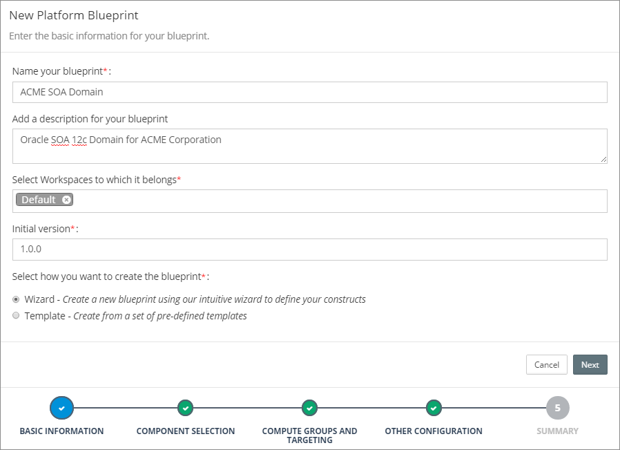

## Creating a Platform Blueprint from an Existing WebLogic Domain
MyST allows us to create a Platform Blueprint based on an existing WebLogic Domain, we simply point MyST at an existing WebLogic Domain, MyST will introspect the platform instance to and create a corresponding Platform Blueprint. MyST also provides the option to create a corresponding Platform Model.

This supports a number of use cases, including:
* We can introspect an existing 11g environment

Note: This is currently only supported for WebLogic, Oracle SOA, Oracle Service Bus and Oracle BPM

you simply point MyST at an existing 11g environment, MyST will introspect the platform instance and create a corresponding 11g Platform Blueprint. 

When performing a side-by-side upgrade,

MyST Studio provides a wizard which guides the user through the end-to-end proces of designing your Platform Blueprint. The wizard is used to capture key design decisions, such as: * Which Oracle Middleware product, version and components do want in your platform? * What topology do you want? For example, do you want * A separate webtier layer? * Separate layers per product component? * An isolated admin server? * What constraints do you want to add to your platform? For example, what is: * The minimum and maximum cluster size? * The target operating system? * What additional platform capabilities do you want to configure? For example: * Do you want encrypted listen addresses for your WebLogic Servers? * Do you want to persist TLogs and JMS Stores to the database or file system? * Do you require GridLink data sources for Oracle Middleware product schemas?Based on the answers provided, MyST will generate a Oracle EDG Compliant Platform Blueprint which can then be used to install and configure your Oracle Middleware Platform.

### Launching the Platform Blueprint Wizard
From the side menu navigate to`Modeling` > `Platform Blueprint`, this will display a list of existing Platform Blueprints. Click on `Create New` in the top right-hand corner of the screen. This will launch the `New Platform Blueprint` wizard.

In the initial dialogue we need to specify the following details about our Platform Blueprint:* **Name** - Short hand name for the Platform Blueprint* **Description** - A longer description of the Platform Blueprint* **Workspaces** - This defines the Workspaces to which the Platfrom Blueprint belongs. See Role Based Access Control for further details.* **Initial Version** - The speficies the initial version of the Platform Blueprint. See Platform Blueprint and Model Versioning for further details.Finally, we need to specify how we want to create the Platform Blueprint. Keep the default selection of `Wizard`. Then click `Next`.
