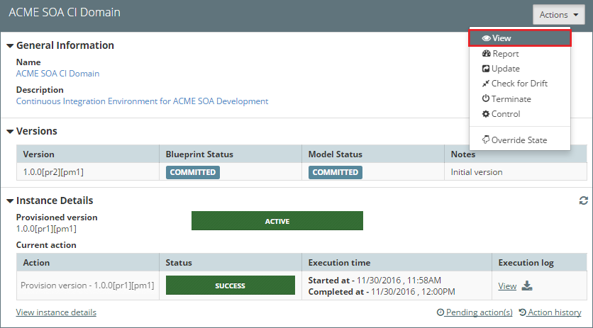
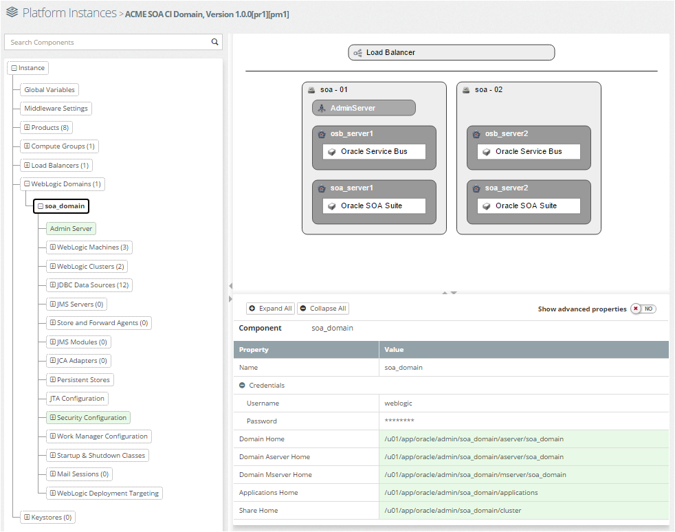
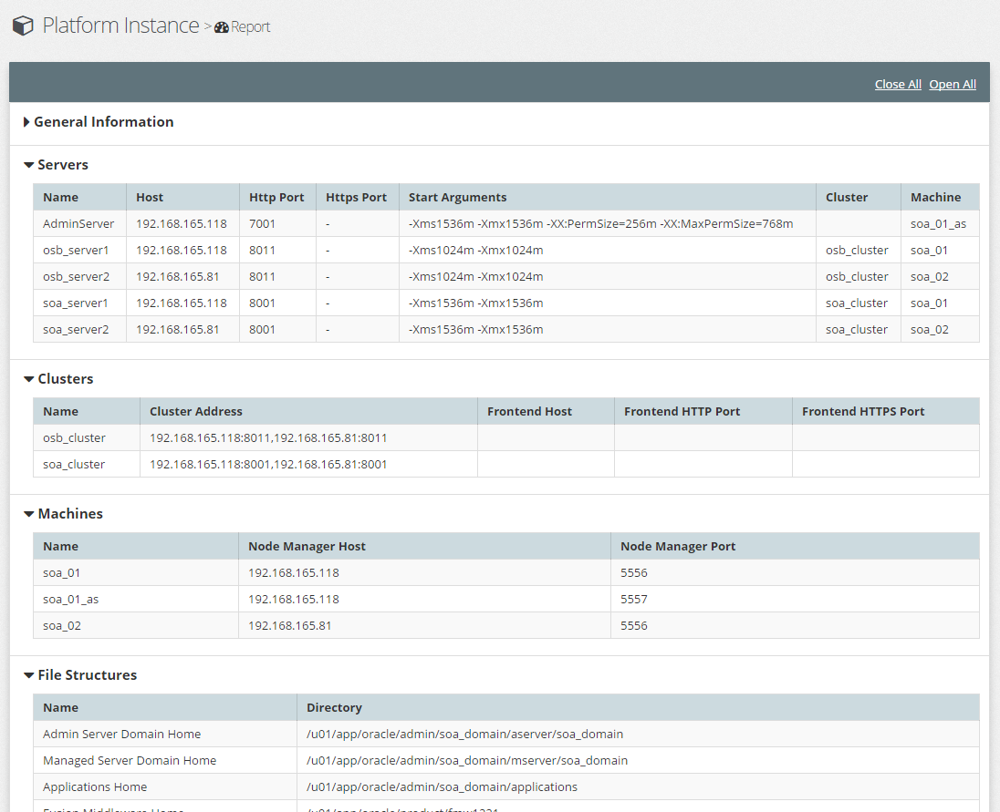
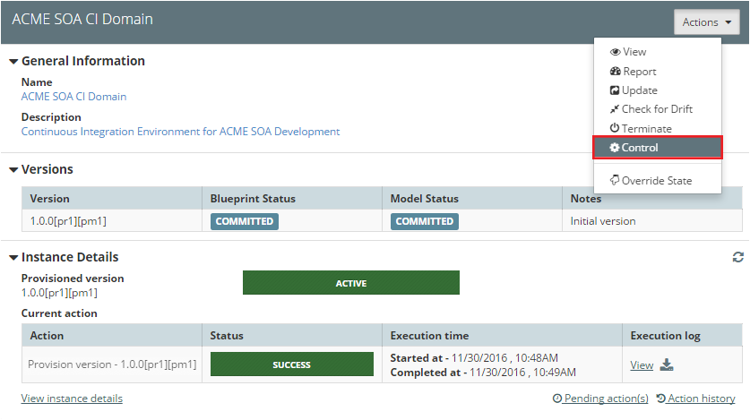
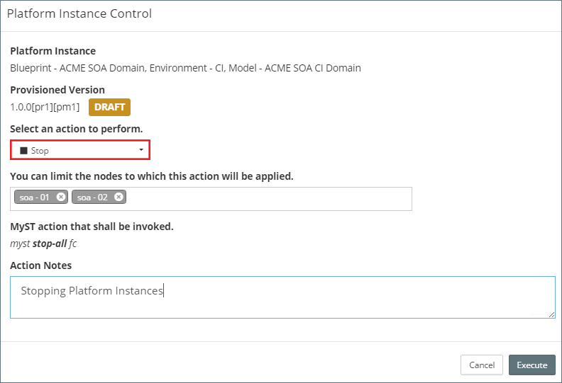

## Manage Platform Instance 

In this section we detail how to perform the following activites:
* Viewing Platform Instance Configuration
* Start, Stop and Restart a Platform Instance
* Patch a Platform Instance
* Update a Platform Instance
* Check for and Correct Configuration Drift
* Overriding the state of a Platform Instance

In addition, we also cover the mechanism MyST uses to queue actions against a Platform Instance as well how to view the ActionHistory as well as the current Action queue

From the side menu navigate to`Provisioning` > `Platform Instances`, this will display a list of existing Platform Instances. 

Select the corresponding Platform Instance (outlined in red above), MyST will display summary information about the state of the Platform Model and Instance Details as shown below.

### Viewing Platform Instance
Click on the `Actions` menu and select `View` (outlined in red above), MyST will open the Platform Instance in the `Platform Viewer`.

From here we can browse the configuration of the Platform Instance. The Platform Viewer is split into three core sections:

1. **Tree View** - Displays a hierarchical view of the Platform Instance. That can be used to navigate the Platform Instance configuration. Selecting a component in the tree view will display a list of properties defined for that component in the properties view.

2. **Topology View** - Helps to visualize the configuration that is defined in the Platform Instance. Selecting a component in the topology diagram will display a list of properties defined for that component in the properties view.

3. **Property View** - Displays the list of properties and corresponding values defined for the selected component in your Platform Instance. 

See the documentation on the [Platform Viewer / Editor](tbc) for more details on how navigate the configuration information.

### Platform Instance Report
The Platform instance report provides a summary report of all the key configuration information for our Platform Instance.

To access this select the corresponding Platform Instance (as described above), then click on the `Actions` menu and select `Report`, MyST will open the Platform Instance Report as shown below.

By clicking on the header for each section, you can close and expand that part of the report as required.

### Start, Stop and Restarting Platform Instance
Select Restart as the action you want to perform. In a clustered environment, you can choose to restart only specific nodes. As we have only one node we can leave all other defaults.

#### Stoping a Platform Instance
From the side menu navigate to`Provisioning` > `Platform Instances`, this will display a list of existing Platform Instances. 

Select the corresponding Platform Instance (outlined in red above), MyST will display summary information about the state of the Platform Model and Instance Details as shown below.

Click on the `Actions` menu and select `Control`, MyST will open the Platform Instance Control dialogue.

Select `Stop` as the action to perform (outlined in red above). In a clustered environment, we can choose to stop only specific nodes.

Enter any notes as to why you are peforming the action and click `Execute`.

MyST will queue the action in the list of Pending jobs for the Platform Instance and when ready proceed to stop the Platform Instance.

#### Starting a Platform Instance
To start a Platform Instance we follow the same process for stopping a Platform Instance, but select `Start` as the action to perform.

#### Restarting a Platform Instance

To restart a Platform Instance we follow the same process for stopping a Platform Instance, but select `Start` as the action to perform.
