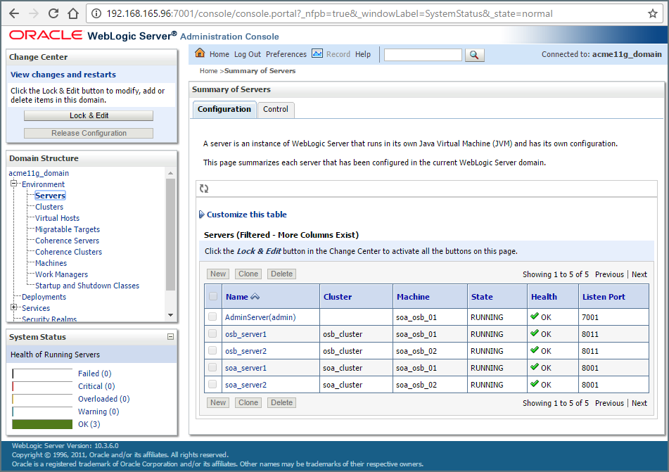
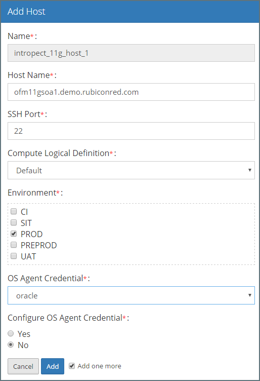
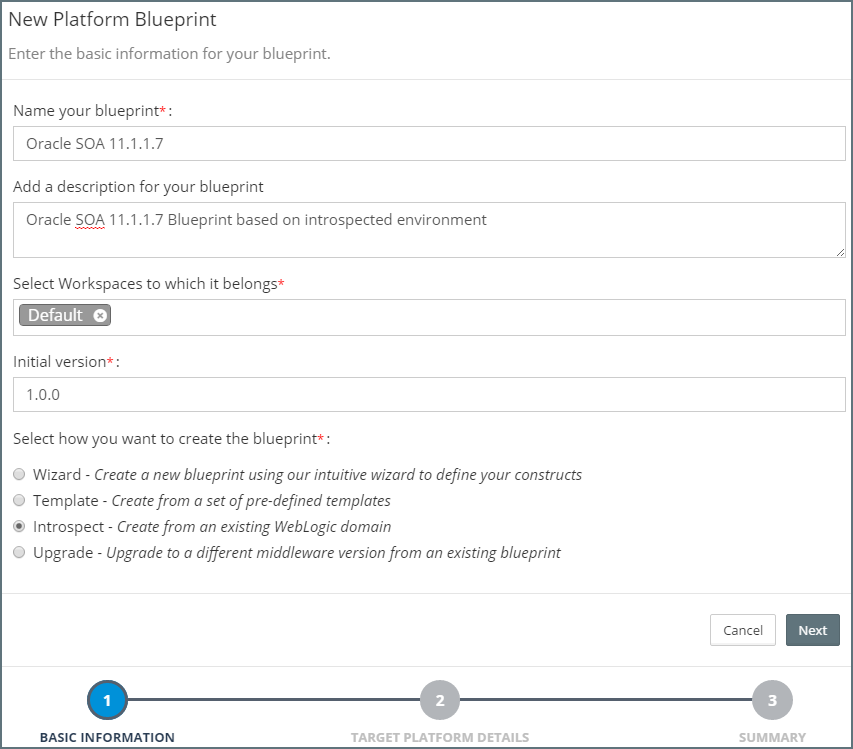
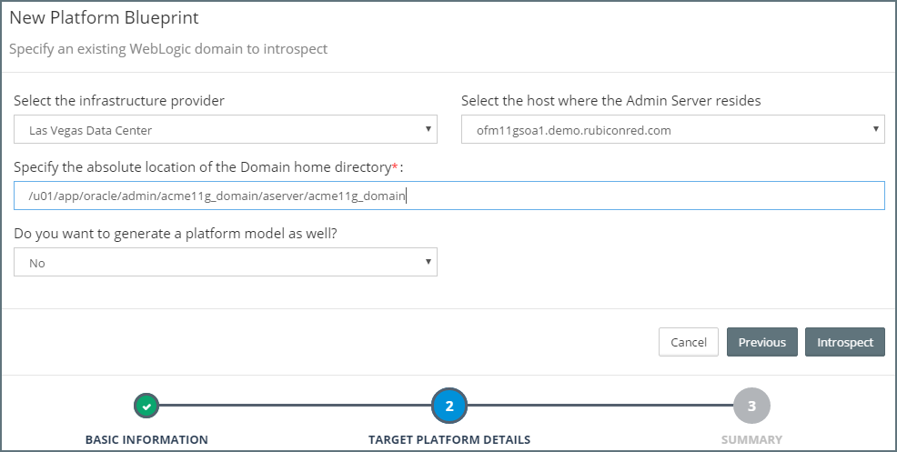
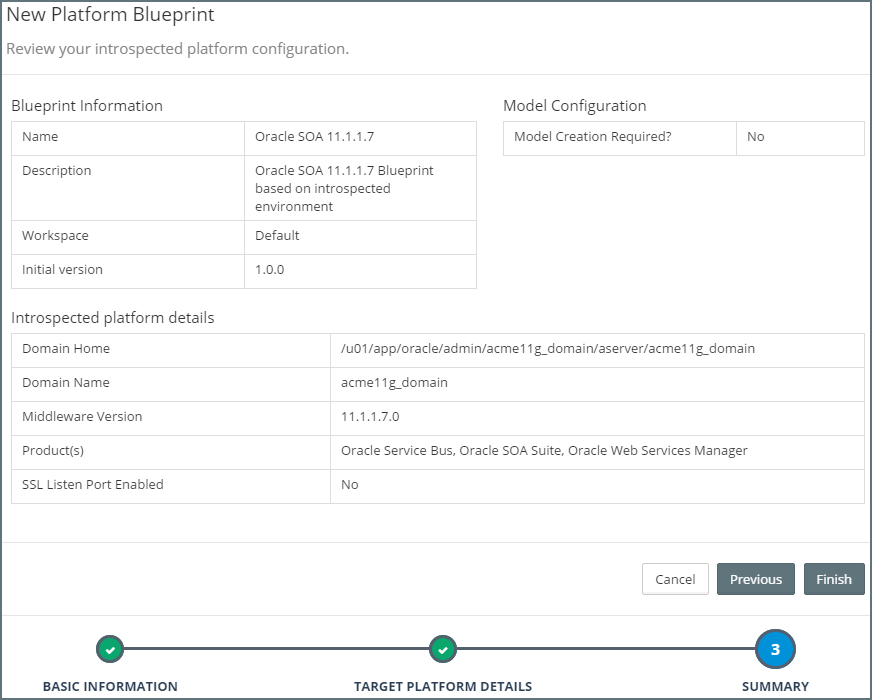
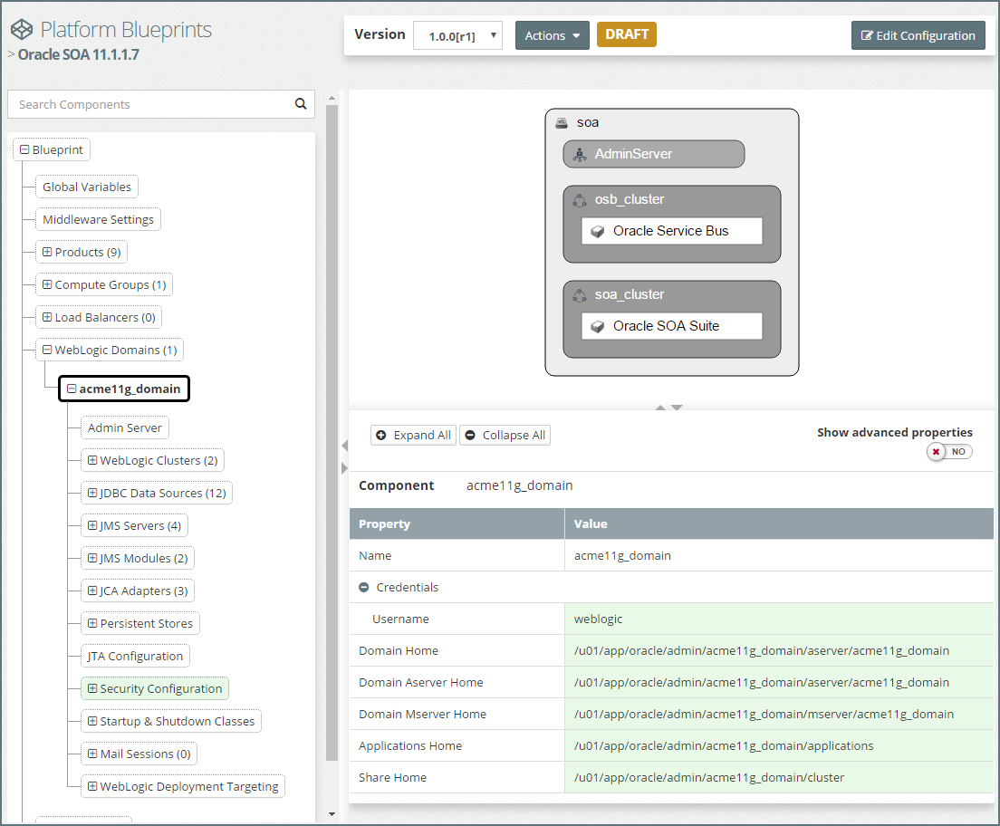

## {{ page.title }}

MyST allows us to create a Platform Blueprint based on an existing WebLogic Domain, we simply point MyST at an existing WebLogic Domain, MyST will introspect the platform instance and create a corresponding Platform Blueprint. MyST also provides the option to create a corresponding Platform Model.

This supports a number of use cases, including:

* **Side-By-Side Upgrade** - We can introspect an existing 11g environment, extract the key configuration information and then use this to automatically provision an equivalent 12c environment in minutes.

* **Lift and Shift to the Cloud** - We can introspect an existing 11g/12c environment and then use MyST to provision an equivalent environment to the cloud.

* **Manage Existing Platform Instance** - When introspecting a Platform instance, we have the option of creating a *Platform Model* for the introspected WebLogic Domain, we can then use MyST to manage on-going configuration changes and code deployments to the introspected platform.

* **Replicate PROD Environment** - We can introspect an existing 11g/12c environment, for example, Production and then use this to provision equivalent non-prod environments (e.g. DEV, SIT, UAT, PRE), and thus quickly ensure all environments are identically configured and eliminate configuration drift.

The end-to-end process consists of three simple steps and can be performed in minutes.

### Step 1. Identify WebLogic Domain to Introspect

For the purpose of this documentation, we are going to introspect an existing Oracle SOA 11.1.1.7 environment running on two VMs, that consists of a 2 node SOA Cluster and 2 node OSB Cluster. As illustrated in the WebLogic Admin Console.

Note: MyST supports introspection of 11.1.1.7, 12.1.3 and 12.2.1 WebLogic, SOA, OSB and BPM environments.

### Step 2. Define WebLogic Domain to MyST

Before we can introspect an existing domain we need to provide details of the physical or virtual servers that the WebLogic domain is to be provisioned to, plus SSH connection details.

To do this in MyST, we need to add each WebLogic host to the Pre-Existing Infrastructure Providers. From the side menu navigate to`Infrastructure` > `Infrastructure Providers`, this will display a list of existing Infrastructure Providers. From here, open the required Infrastructure Provider (or simply add a new one).

This will open the **Infrastructure Providers** screen, from here we need to define a host for each of our existing WebLogic hosts. To do this, click `Add Host`.

For each host we need to specify the following details:

* **Name** - Name within MyST used to refer to the host.
* **Host Name** - Network address of the host, can also be the IP Address.
* **Compute Definition** - Used to specify the Operating System of the target host.
* **SSH Port** - The SSH Port of the target host, defaults to 22.
* **Environment(s)** - Hosts must be tagged to one or more Environments. This integrates with the Role Based Access Control to define who has access to the host.
* **OS agent credentials** - The OS agent credentials is the set of credentials that MyST uses to connect to the host over SSH and run the MyST introspection agent on the host. These credentials consist of the SSH user name and either a password or a key pair (these are also defined within the Infrastructure Provide.

* **Configure OS Agent Credential** - For introspection purposes, we can leave this set to `No`.

### Step 3. Introspect SOA / BPM Domain

From the side menu navigate to`Modeling` > `Platform Blueprint`, this will display a list of existing Platform Blueprints. Click on `Create New` in the top right-hand corner of the screen. This will launch the `New Platform Blueprint` wizard.

In the initial dialogue we need to specify the following details about our Platform Blueprint:

* **Name** - Shorthand name for the Platform Blueprint.
* **Description** - A longer description of the Platform Blueprint.
* **Workspaces** - This defines the Workspaces to which the Platform Blueprint belongs. See Role-Based Access Control for further details.
* **Initial Version** - Specifies the initial version of the Platform Blueprint, we will stick with the default.

Finally, we need to specify that we want to use **introspection** to create the Platform Blueprint. Select `Introspect` and click `Next`.

#### Specify WebLogic Domain to Introspect

Next, we need to specify the host for the WebLogic Admin Server. First select the infrastructure provider where we defined our WebLogic hosts (in step 1), then from the drop down select the host for the WebLogic Admin Server.

Next specify the absolute location of the WebLogic Domain home directory, which is something like:

`/u01/app/oracle/admin/<domain_name>/aserver/<domain_name>`

At this point we are not going to create a Platform Model, so leave the default option of `No` for this drop down.

Finally, click `introspect`. MyST will introspect the target Platform Instance. Click `Next` to view the summary.

#### Review the Summary

MyST will display a Summary screen showing details of the introspected Platform.

Once done, click `Finish`.

#### View/Edit Platform Blueprint
MyST will create the corresponding Platform Blueprint and take you to the Platform Blueprint Editor where you can make additional configuration changes if required.

We can now use this Platform Blueprint to provision an equivalent WebLogic Domain either on-premise or in the cloud.

Alternatively, we can upgrade the Platform Blueprint to a newer version and use it provision an equivalent upgraded environment - see [Chapter 3.8 Side by Side Upgrades](../3.8.sideBySideUpgrade/3.8.0.sideBySideUpgrade.md) for further details.

.