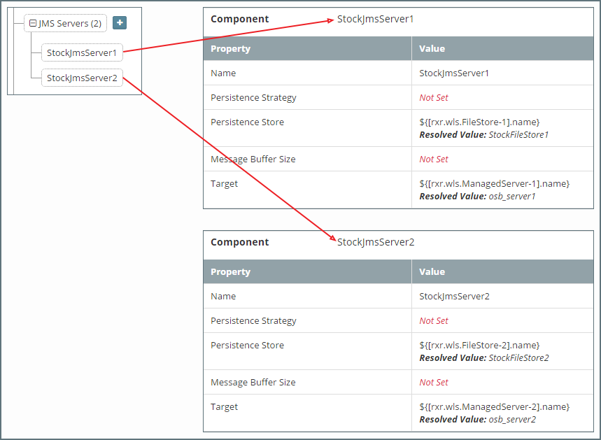
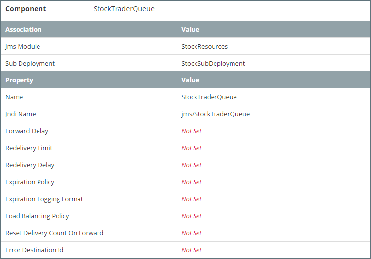
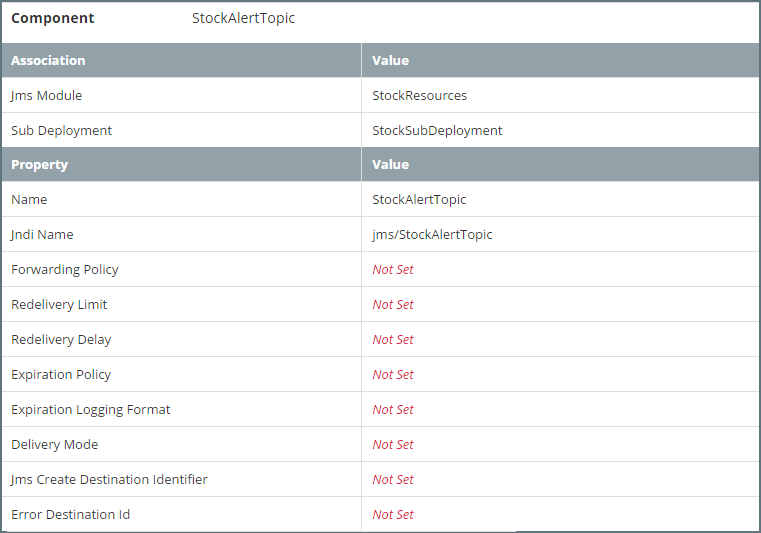


### Configure a JMS Server
To configure a JMS Server in the Platform Blueprint, open the Platform Blueprint Editor and navigate to `Blueprint > WebLogic Domains > [domain_name] > JMS Servers`. Expand this component to see a list of currently defined JMS Servers.

Either select an existing JMS Server to edit or click on the `+` icon to add a new JMS Server.

For each JMS Server we need to specify the following properties:
* **Name** - Name for the JMS Module.
* **Persistence Strategy**  - This only needs to be set if we need to override the  global persistence strategy.
* **Persistence Store**  -  The persistent store for the JMS Server. It is recommended to use a MyST property reference, for example `${[rxr.wls.FileStore-1].name}`
* **Message Buffer Size**  - Optional. This only needs to be set to overide the default value used by WebLogic.
* **Target** - The server instance on which to deploy the JMS Server. It is recommended that the target be defined as a MyST property reference, for example `${[rxr.wls.ManagedServer-1].name}`.

We will typically want to define a JMS Server for each managed server instance in the targeted cluster. Each JMS Server will need to be pinned to a seperate managed server in the cluster and will require a dedicated persistence store. So for a two node cluster, we would define two JMS Servers as illustrated below.

### Configure a JMS Module
A JMS Module is a configuration container for other JMS Resources, such as Connection Factories, Distributed Queues, and Distributed Topics.

To configure a JMS Module in the Platform Blueprint, open the Platform Blueprint Editor and navigate to `Blueprint > WebLogic Domains > [domain_name] > JMS Modules`. Expand this component to see a list of currently defined JMS Modules.

Either select an existing JMS Module to edit or click on the `+` icon next to JMS Modules to create a new JMS Module.

For each JMS Module we need to specify the following properties:
* **Name** - Name for the JMS Module.
* **Target** - The cluster or set of servers instance to which the JMS Module is targetted. It is recommended that the target be defined as a MyST property reference, for example `${[rxr.wls.Cluster-1].name}`.

We will typically define a JMS Module targetted at a specific cluster, as illustrated below.

#### Configure Sub Deployments
Sub Deployments allow a subset of a modules resources to be selectively targeted to a set of JMS Servers.

Navigate to Sub Deployments under the JMS module. Either select an existing Sub Deployment to edit or click on the `+` icon to add a sub deployment.

For each Sub Deployment we need to specify the following properties:
* **JMS Module** - The JMS Module to which the Sub Deployment is associated.
* **Name** - Name for the Sub Deployment.
* **Target** - The set of JMS Server targetted by the Sub Deployment. It is recommended that the target be defined using MyST property references, for example `${[rxr.wls.JmsServer-1].name}, ${[rxr.wls.JmsServer-2].name}`.

We will typically define one subdeployment per JMS Module and target it to the set of JMS servers running on the WebLogic Server cluster / instances targeted by the JMS Module, as illustrated below.

#### Configure Connection Factory
Navigate to Connection Factory under the JMS module. Either select an existing Connection Factory to edit or click on the `+` icon to add a Connection Factory.

For each Connection Factory we need to specify the following properties:
* **JMS Module** - The JMS Module to which the Connection Factory is targetted.
* **Sub Deployment** - The Sub Deployment to which the Connection Factory is targetted.
* **Name** - Name for the Connection Factory.
* **Jndi Name** - The set of JMS Server targetted by the Sub Deployment. It is recommended that the target be defined using MyST property references, for example `${[rxr.wls.JmsServer-1].name}, ${[rxr.wls.JmsServer-2].name}`.

#### Configure Uniform Disributed Queue

#### Configure Uniform Disributed Topic

