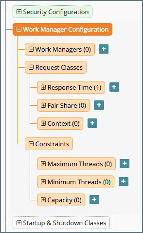
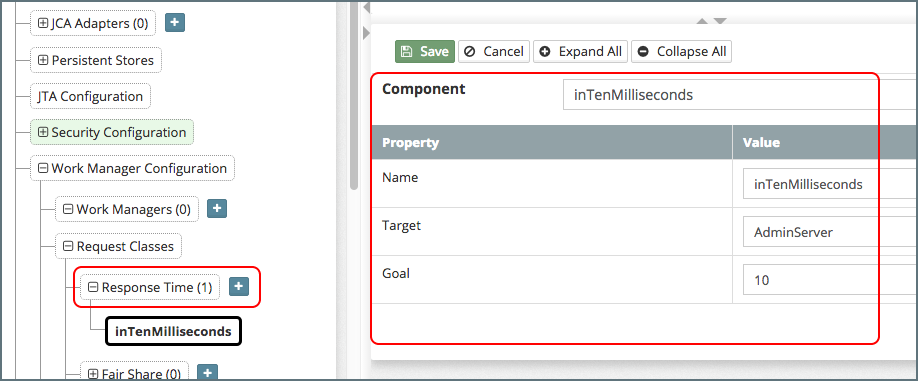
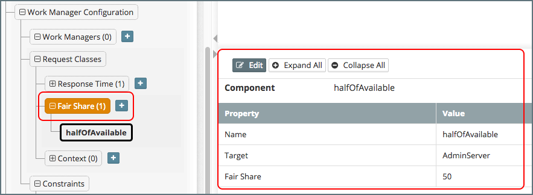
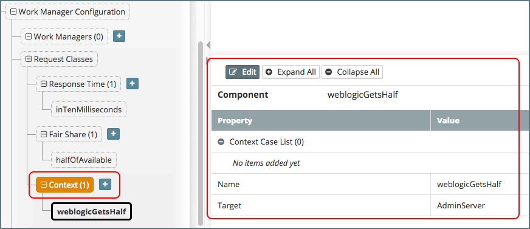
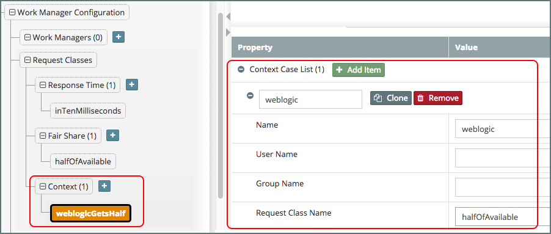
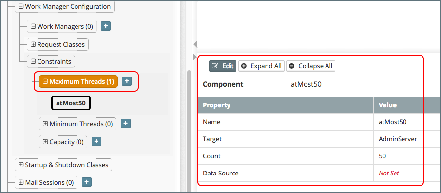
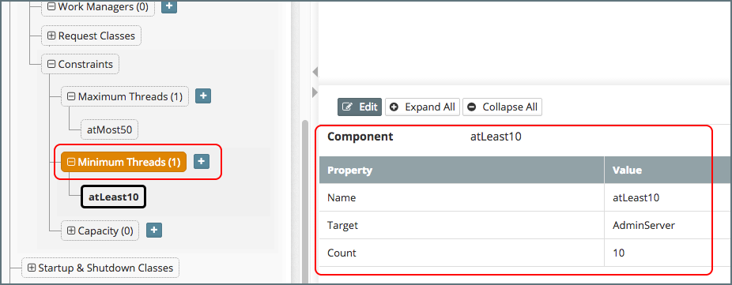
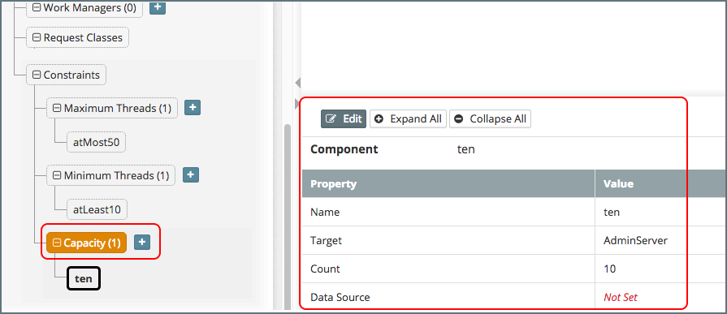
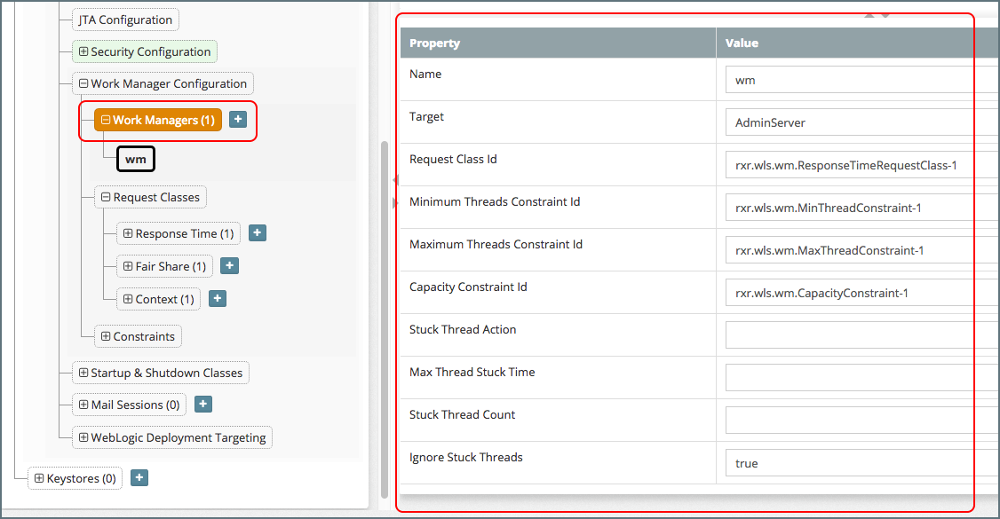

## {{ page.title }}
WebLogic Server provides a number of constraints and request classes used to provide guidelines to WebLogic Server for allocating resources to process work requests, as well as work managers which provide a collection of these constraints and request classes to give an overall behaviour. MyST Studio groups configuration for all of these objects under **Work Manager Configuration**.

The first displayed entry is `Work Managers`, but because work managers refer to most other object types, we'll come back to those in a moment.

### Configuring Response Time Request Classes

Response Time Request Classes are used to indicate that a given request should be processed within an ideal timeframe, which is expressed in milliseconds. It's important to note that this is not the response time experienced by a client application or end user, but the response time for an individual item of work performed by a server-side component.

To create a response time request class in MyST Studio:

1. Navigate to `WebLogic Domains > [domain name] > Work Manager Configuration > Request Classes > Response Time`
2. Click `+` to the right of `Response Time` to add a new response time request class
3. Click the `Edit` button above the table of properties

To configure a response time request class, the following must be provided:

* **Name** - the name displayed for the request class in the WebLogic Admin Console, and used in any configuration referring to the request class
* **Target** - the server the request class will be targeted to
* **Goal** - ideal response time expressed in milliseconds

### Configuring Fair Share Request Classes

Fair Share Request Classes are used to indicate the percentage of available threads that should be allocated to work during periods where all available worker threads are in use.

To create a fair share request class in MyST Studio:

1. Navigate to `WebLogic Domains > [domain name] > Work Manager Configuration > Request Classes > Fair Share`
2. Click `+` to the right of `Fair Share` to add a new fair share request class
3. Click the `Edit` button above the table of properties

To configure a fair share request class, the following must be provided:

* **Name** - the name used for the request class in the WebLogic Admin Console, and used in any configuration referring to the request class
* **Target** - the server the request class will be targeted to
* **Fair Share** - the percentage or weighting allocated to work requests using this request class

### Configuring Context Request Classes
Context Request Classes are used to provide specific resource allocation behaviour to requests performed on under a particular identity context. The behaviour of context request classes is determined by individual context cases, each of which specify either a user or group context, and a specific request class to use for that identity context.

To create a context request class in MyST Studio:

1. Navigate to `WebLogic Domains > [domain name] > Work Manager Configuration > Request Classes >  Context`
2. Click `+` to the right of `Context` to add a new context request class
3. Click the `Edit` button above the table of properties

To configure a context request class, the following must be provided:

* **Name** - the name used for the request class in the WebLogic Admin Console, and used in any configuration referring to the request class
* **Target** - the server the request class will be targeted to

### Configuring Context Cases
Context Cases are encapsulate how individual identity contexts are treated by a context request class.

To create a context case in MyST Studio, click the `+ Add Item` button to the right of `Context Case List`

To configure a context case, the following must be provided:

* **Name** - the name used for the context case in the WebLogic Admin Console, and used in any configuration referring to the context case
* Either **User Name** or **Group Name** to indicate the identity context the context case will manage requests for
* **Request Class Name** - the name of another configured request class (either Fair Share or Response Time Request Class) used to manage requests under the defined identity context

### Configuring Maximum Thread Constraints
Maximum Thread Constraints are used primarily to avoid deadlock situations in server processing through all available threads being allocated to one component when processing requests involving multiple server-side components overall, or preventing upstream congestion from consuming expensive resources while waiting for limited backend components to complete processing.

To create a maximum thread constraint in MyST Studio:

1. Navigate to `WebLogic Domains > [domain name] > Work Manager Configuration > Constraints > Maximum Threads`
2. Click `+` to the right of `Maximum Threads` to add a new maximum threads constraint
3. Click the `Edit` button above the table of properties

To configure a maximum thread constraint, the following must be provided:

* **Name** - the name used for the constraint in the WebLogic Admin Console, and used in any configuration referring to the constraint
* **Target** - the server the constraint will be targeted to
* **Count** - the maximum number of threads allocated to work managed by this constraint
* **Data Source** - can be used instead of **Count** to size the total number of threads allocated to work based on the maximum size of the specified data source connection pool. Particularly useful for any database connection-bound work.

### Configuring Minimum Thread Constraints
Minimum Thread Constraints are used to help avoid deadlock situations in server processing through all available threads being allocated to one component when processing requests involving multiple server-side components overall, or to indicate prioritisation in situations where all available worker threads are allocated to performing work.

To create a minimum thread constraint in MyST Studio:

1. Navigate to `WebLogic Domains > [domain name] > Work Manager Configuration > Constraints > Minimum Threads`
2. Click `+` to the right of `Minimum Threads` to add a new minimum threads constraint
3. Click the `Edit` button above the table of properties

To configure a minimum thread constraint, the following must be provided:

* **Name** - the name used for the constraint in the WebLogic Admin Console, and used in any configuration referring to the constraint
* **Target** - the server the constraint will be targeted to
* **Count** - the minimum number of threads allocated to work managed by this constraint

### Capacity Constraints
Capacity Constraints are used to provide a guide for how many requests the server should allow to be queued waiting for worker threads before rejecting incoming requests.

To create a capacity constraint in MyST Studio:

1. Navigate to `WebLogic Domains > [domain name] > Work Manager Configuration > Constraints > Capacity`.
2. Click `+` to the right of `Capacity` to add a new context request class
3. Click the `Edit` button above the table of properties

To configure a capacity constraint, the following must be provided:

* **Name** - the name used for the constraint in the WebLogic Admin Console, and used in any configuration referring to the constraint
* **Target** - the server the constraint will be targeted to
* **Count** - the number of requests to allow to be queued for processing before beginning to reject incoming requests for work
* **Data Source** - can be used instead of **Count** to size the queue of incoming requests for work based on the maximum size of the specified data source connection pool. 

### Configuring Work Managers
Work Managers are the higher level component that make use of all of these request classes and constraints to encapsulate a complex set of performance behaviours at runtime. Work Managers are the objects referred to by application configuration to indicate preferred behaviour for allocating and managing resources for performing work at runtime.

To create a work manager in MyST Studio:

1. Navigate to `WebLogic Domains > [domain name] > Work Manager Configuration > Work Managers`
2. Click `+` to the right of `Work Managers` to add a new work manager
3. Click the `Edit` button above the table of properties

To configure a work manager, the following must be provided:

* **Name** - the name used for the work manager in the WebLogic Admin Console, and used in any configuration referring to the constraint
* **Target** - the server the work manager will be targeted to

The following properties may be provided:

> Whenever an object's *ID* is referred to, this is the identifier used to indicate an object in the tree view structure of the model or blueprint. This may be the same as the *Name* property of an object, or may be completely different.

* **Request Class Id** - the ID of a Response Time Request Class, Fair Share Request Class or Context Request Class used by the work manager
* **Minimum Threads Constraint Id** - the ID of a Minimum Threads Constraint used by the work manager
* **Maximum Threads Constraint Id** - the ID of a Maximum Threads Constraint used by the work manager
* **Capacity Constraint Id** - the ID of a Capacity Constraint used by the work manager
* **Stuck Thread Action** - action to perform once a thread is detected as stuck
* **Max Thread Stuck Time** - time after which a thread is considered stuck by the work manager
* **Stuck Thread Count** - total number of stuck threads permitted by the work manager before it is shut down
* **Ignore Stuck Threads** - whether the work manager should ignore stuck threads

For more information on the configuration of work managers, refer to [Oracle's MBean documentation](https://docs.oracle.com/middleware/1221/wls/WLACH/pagehelp/J2EEappworkworkmanagerconfigtitle.html).

