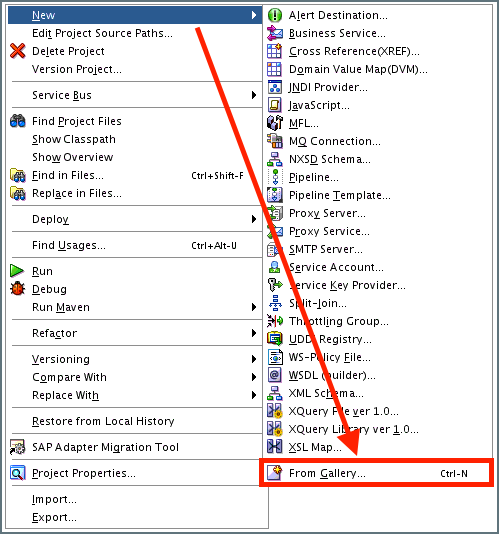
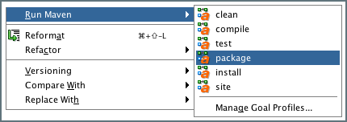

## Building Oracle Service Bus Projects with Maven
This section provides details on how to use the Oracle Service Bus Maven archetypes to build Oracle Service Bus applications.

### Create OSB Project Object Model
Within JDeveloper locate the OSB project that you wish to automnate the build for. Right click on the project and click `New` and then select `Fron Gallery`.



Type `pom` into the Search Bar and then select `Empty POM (Maven)`.


Click `OK`. JDeveloper will open the `Create a Maven POM` dialogue. Leave the defaults when prompted to enter the location and click Ok.


If prompted to overwrite an existing file, select Yes.


JDeveloper will then prompt us to 


* **Group Id:** The groupId for your new project. This usually starts with your organization's domain name in reverse format. For example `com.acme`.
* **Artifact Id:** The artifactId for your OSB project. This is usually an identifier for this project.
* **Version:** The version for our OSB project. This is usually 1.0-SNAPSHOT for a new project.
* **Packaging** - This must be set to `sbar`
* **Parent > Group Id** - This must be set to `com.oracle.servicebus
`
* **Parent > Artifact Id** - This must be set to `sbar-project-common`
* **Parent > Version** - This must be set to the version of the Oracle Service Bus, for example, 12.1.3-0-0 or 12.2.1-0-0.


Click on the Source tab. The source should appear as the following:
```
<?xml version="1.0" encoding="UTF-8"?>
<project xmlns="http://maven.apache.org/POM/4.0.0">
    <modelVersion>4.0.0</modelVersion>
    <groupId>com.acme</groupId>
    <artifactId>StockServices</artifactId>
    <version>1.0-SNAPSHOT</version>
    <packaging>sbar</packaging>
    <parent>
        <groupId>com.oracle.servicebus</groupId>
        <artifactId>sbar-project-common</artifactId>
        <version>12.2.1-0-0</version>
    </parent>
</project>
```

Once completed, save the POM.

### Test Validate Automated Build
Prior to configuring our CI Server to run an automated build.

Right-click on the project and click `Run Maven` then `package`.



You will see the Maven build running in the `Apache Maven - package` tab.
 Omce the build has completed successfully, the output should look similar to the following.


Navigate to the folder .data/maven on the file system under the project home. You should see a file created called `sbconfig.sbar`.

> Once we have created our Project Object Model (pom.xml). We **must** commit it to our Version Control System so that we can perform automated builds from our CI Server.