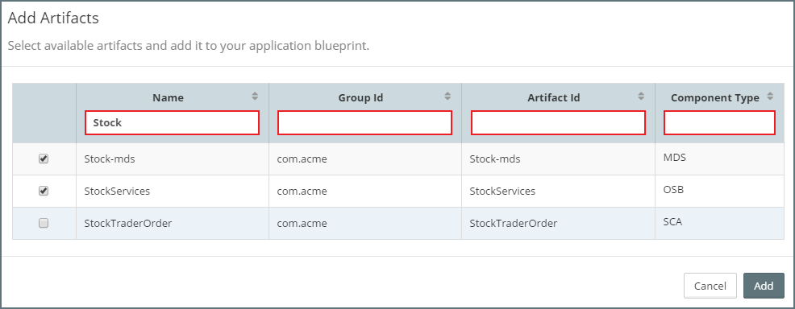
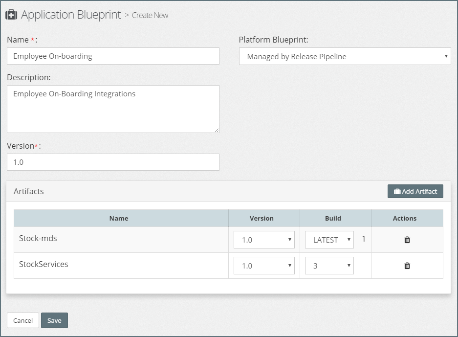

## Configuring Application Blueprints

### List Application Blueprints
From the side menu navigate to`Release Management` > `Application Blueprints`, this will display a list of existing Application Blueprints, similar to the one below.

By default, MyST will display the list of Application Blueprints using the `Card view`. To switch to the list view, click on the `List View` icon (outlined above in red). MyST will display the Applications Blueprints in a list, as illustrated below.

In the list view we are able to filter the list, by typing part of the Application Blueprint name in the `Name` filter (outlined above in red).

### Creating a New Release Pipeline
Click `+ Create New`, this will open the **Application Blueprint** dialogue. Here we need to specify the following values:

* **Name** - Short hand name for the Application Blueprint
* **Description** - A longer description of the Application Blueprint
* **Version** - Speficies the initial version of the Application Blueprint. See Application Blueprint versioning for further details.

Next, we need to add the required artifacts to our application blueprint. Click on `Add Artifact`, this will open the `Add Artifacts` window, which by default will list all artifacts available.

For each artifact, MyST displays the following information:
* **Artifact Name** - The artifact name
* **Artifact Group Id** - The maven group id of the artifact.
* **Artifact Id** - The maven artifact id of the artifact.
* **Component Type** - This is the type of artifact, for example OSB, SCA, MDS, JAR and so on.

We can filter this list on one or more of these values, by entering the filter criteria in the corresponding filter fields (outlined in red).

To add an artifact, simply select its checkbox; to remove an artifact from an Appication Blueprint, then deselect it.

Once happy with the selection click `Add`. This will return us to out Application Blueprint, where we can see the list of Artifacts that we have added.

* **Artifact Version** - This is the artifact binary version. 
* **Build No** - The build no of the artifact

Notice it defaults to the LATEST build number. If you wanted to lock the artifact down to a specific version you could select a specific Build number.

By default, the stages in our Release Pipeline, plus the sequence and configuration of each stages is pre-configured as defined by the Release Pipeline Template. We can edit these if required.

