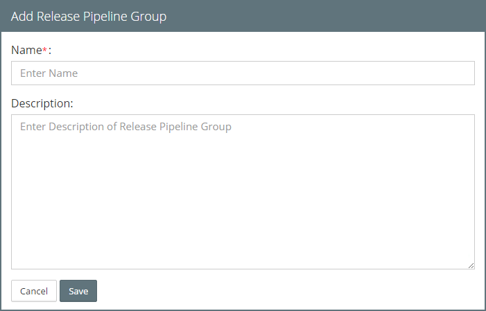

## Release Pipeline Groups
Release Pipeline Groups allows us to categorize each Release Pipeline. 

For example, say we had an integration project with multiple production releases (for exampe release 1.0, 1.1, 2.0, and so on). We may choose to create a seperate Release Pipeline for each release, but place them in the same Released Pipeline Group.

> Note: Currently Release Pipeline Groups are not used for reporting purposes. This is intended to reporting capability that will be delivered in future versions of MyST.

### List Release Pipeline Groups
From the side menu navigate to`Release Management` > `Pipeline Groups`, this will display a list of existing Release Pipeline Groups, similar to the one below.

### Creating a New Release Pipeline Group
Click `+ Create New`, this will open the **Release Pipeline Group** dialogue. Specify the following values:

* **Name** - Short hand name for the Pipeline Group.
* **Description** - A longer description of the Pipeline Group.

Click `Save` to Save the new Release Pipeline Group.

## Edit Release Pipeline Group
To edit the Pipeline Group; click on the `Edit` button for the corresponding Pipeline Group, this will open the **Edit Release Pipeline Group** dialogue.

Here you can modify the Name and Description of the Pipeline Group. Once done, click `Save` to confirm your changes.

