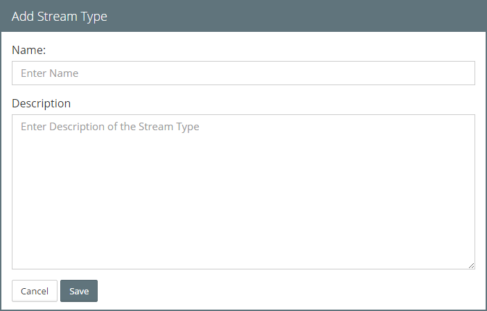

## Stream Types
Stream Types allows us to categorize each **Stream** within a Release Pipeline. 

For example, we have multiple projects running in parrallel, e.g. a BPM Project, an API Project and an Integration Project. Each of these projects would have a seperate Release Pipeline.

Each project may contain a stream deploying services to an Oracle Service Bus domain (plus other streams which are project specific).

We can assign the stream type `OSB` to each OSB Stream, allowing us to categorize streams across release pipelines.

> Note: It is intended that reporting capabilities to be delivered in future versions of MyST will provide reporting by Stream Type. For example, allowing production of a report that shows all active releases for a particular stream type, such as OSB in the above example.

### List Stream Types
From the side menu navigate to`Release Management` > `Stream Types`, this will display a list of existing Stream Types, similar to the one below.

### Creating a New Stream Types
Click `+ Create New`, this will open the **Stream Types** dialogue. Specify the following values:

* **Name** - Short hand name for the Stream Type.
* **Description** - A longer description of the Stream Type.

Click `Save` to Save the new Stream Type.

## Edit Stream Type
To edit a Stream Type; click on the `Edit` button for the corresponding Stream Type, this will open the **Edit Stream Type** dialogue.

Here you can modify the Name and Description of the Stream Type. Once done, click `Modify` to confirm your changes.

