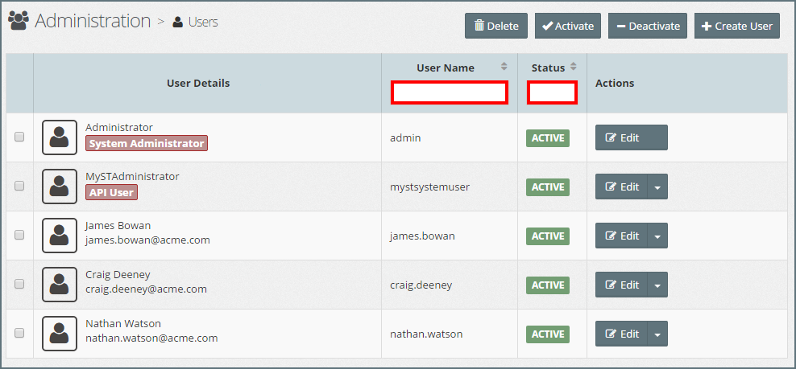
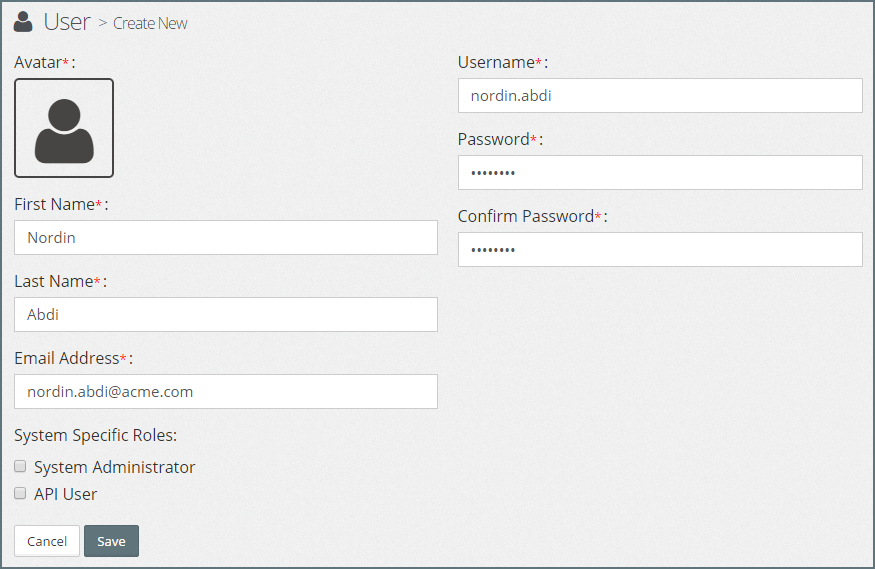
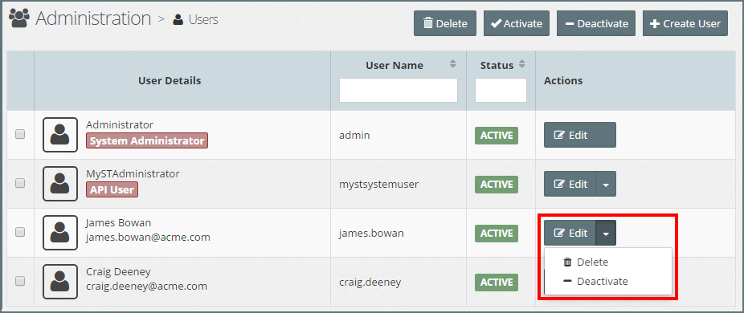

## User Management

Each user has an individual account that at a minimum includes a unique login id, username and password.

Within MyST, **users** are not assigned permissions directly, but only acquire them through the **role\(s\)** assigned to them within one or more **workspaces**.

Users can also be assigned System Roles, which will enable them to manage system specific configurations.

### List Users

To see a list of MyST Users, click  `Administration` &gt; `Users`. This will display a list of Users similar to the one below.

The list can be filtered \/ sorted by User Name or Status, by entering the filter criteria in the filter fields \(outlined in red in the above screen-shot\)\/

### Creating a New User

Click `+ Create User`, this will open the **Add User** dialogue. Specify the following values:

* **First Name:** First name of the user
* **Last Name:** Last name of the user
* **EMail Address:** Users email address
* **Username:** Username for the account, can only consist of alphanumeric, period and underscore characters. Must be unique within MyST.
* **Password:** User Password
* **System Administrator:** Select the check box to assign the `System Administration` role to the user.
* **API User:** - Select the check box to indicate that the user is an API User \(see tbd\).

Click `Save` to create the User Account. Once saved the user will be able to login into MyST with the provided username and password.

**Note**: At this point the user will not have any privileges to perform any actions within MyST.

### Edit User Account

To edit the user account; click on the `Edit` button for the corresponding User, this will open the **Edit User** dialogue.

Here you can modify the First Name, Last Name, Email Address and System Specific Roles of the User. Once done, click `Save` to confirm your changes.

#### Change User Password

To reset the user password, from within the Edit User dialogue, click `Change Password`,  this will open the **Change Password** dialogue. Enter the new password and click `Change Password` to confirm.

#### Change Username

To change the username, from within the Edit User dialogue, click `Change Username`,  this will open the **Change Username** dialogue. Enter the new username and click `Change username` to confirm.

### Activate \/ Deactivate User

By default, when you create a User, it is in an active state. Meaning that the user is able to log into MyST and perform any actions for which they have been granted privileges.

To disable access to MyST, we can deactivate the User Account.

**Note**:

* Deactivating a User account does not remove any workspaces roles they have been granted, but prevents them from logging in and performing any of those roles.
* A deactivated User account can be reactivated at any time.

To deactivate a User account; click on the  **Actions** drop-down menu for the corresponding User and select `Deactivate` as illustrated below.

To activate a deactivated environment; click on the  **Actions** drop-down menu for the corresponding User account and select `Activate`.

### Delete User

To delete a User account; click on the  **Actions** drop-down menu for the corresponding User and select `Delete`. We will be prompted to confirm out action, click `Yes` to proceed.

When deleted the user will be removed from any workspaces to which they belong.

