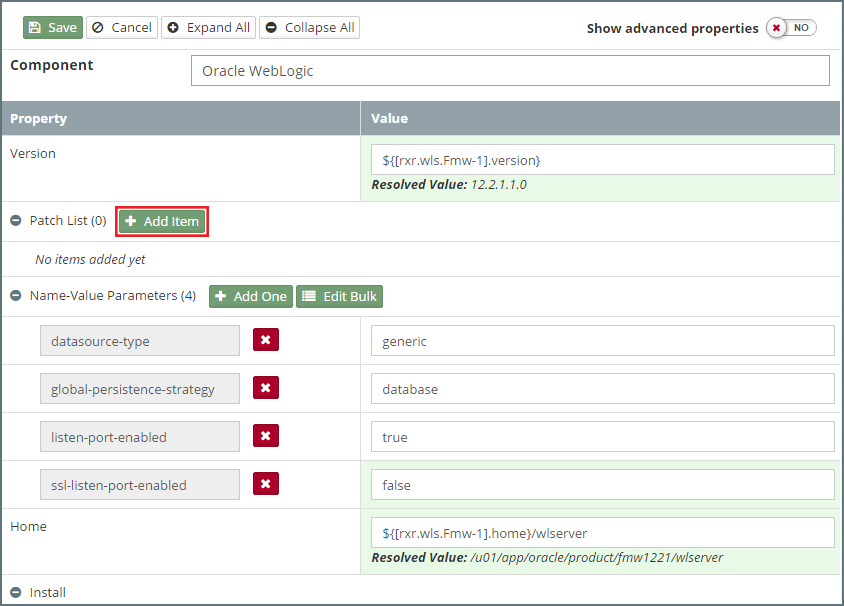
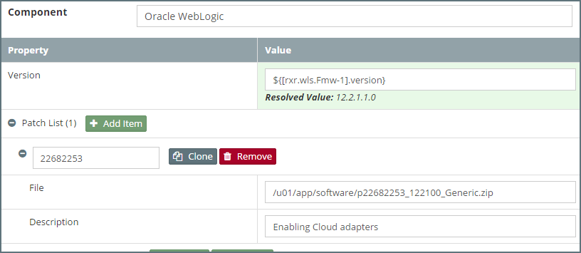
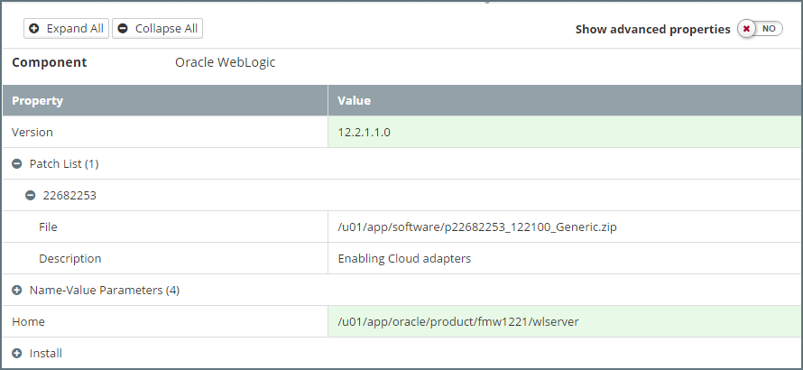

## {{ page.title }}

Oracle often provides patches for their products. These patches can be applied through a utility provided by Oracle known as OPatch. MyST Studio has full support for applying these Oracle patches. This can be done by defining patches directly in the Platform Blueprint.

> Note: Prior to 12c, WebLogic patches were not applied by OPatch and were instead done through a tool called BSU. MyST Studio has support for both OPatch and BSU allowing patching for any of the products in the 11g and 12c product families.

Before MyST Studio can apply patches, they need to be first downloaded from My Oracle Support. Once downloaded, patches should be made available for consumption by MyST Studio. One common approach for doing this is to place the patches on a software share that is made available to all target hosts. This is the approach that we will take.

### Add Patch to Platform Blueprint
How you apply a patch depends on whether you are patching an Oracle Middleware 11g or 12c instance:

* **Oracle Middleware 11g** - Oracle patches are applied on a per-product basis. This means that in the MyST Studio blueprint editor, you would define the patches under the specific product being patched. 

* **Oracle Middleware 12c** - Oracle patches are applied globally for all of Oracle Middleware rather than on a per product basis. For that reason, in 12c, it is **recommended** to define patches under Oracle WebLogic as a convention.

To add a patch to the Platform Blueprint, open the Platform Blueprint in Edit mode and navigate to `Blueprint > Products  > Oracle WebLogic`.

With the `Component` in edit mode, locate the `Patch List` and click on `+ Add Item`. 

This will add a new `Patch` to the Patch List. For each Patch we need to specify the following properties:

* **Patch Id** - The patch id provided by Oracle that identifies the patch.
* **File** - The absolute path to the file that contains the Patch.
* **Description** - Free format text field that explains the purpose of the patch

Once done click `Save`.

### Applying the Patch to a Platform Instance
If the patch is added to the Platform Blueprint prior to provisioning the Platform Instance then the patch will be automatically applied as part of the provisioning process. 

If the Platform Instance has already been provisioned then we will need to apply the patch, for details on how to do this, see the section on [Patching a Platform Instance
 in Chapter 3.6 - Managing Platform Instances](/platform/management/README.md) for further details.

