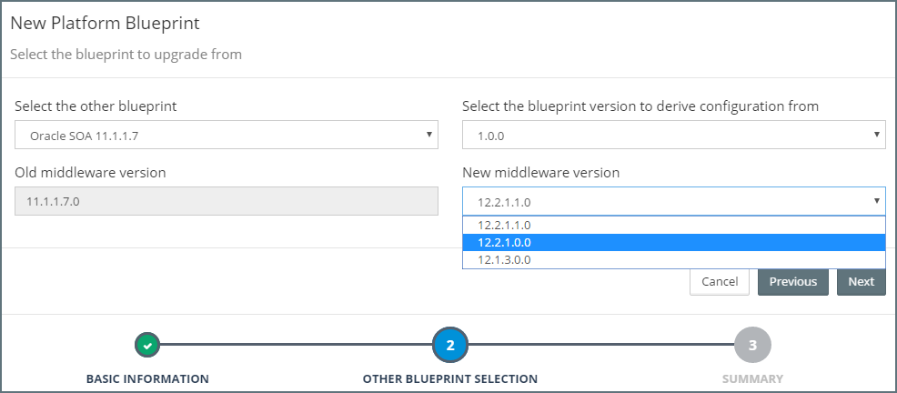
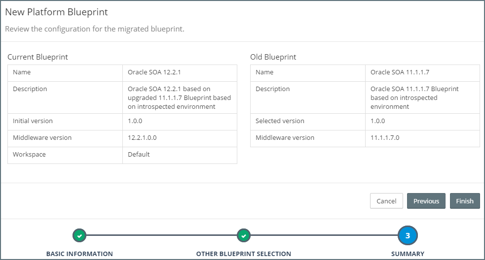
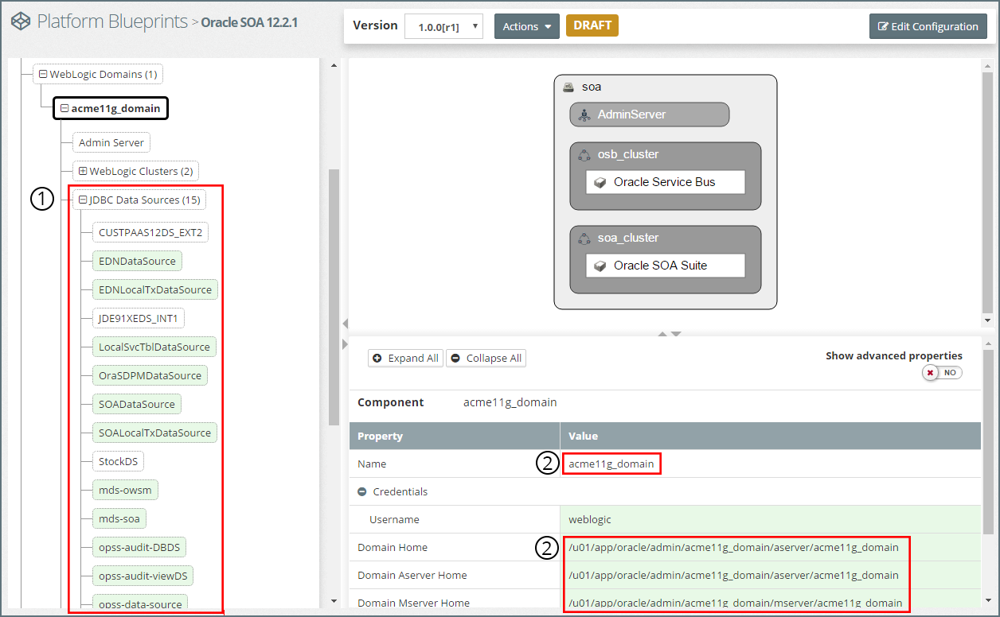
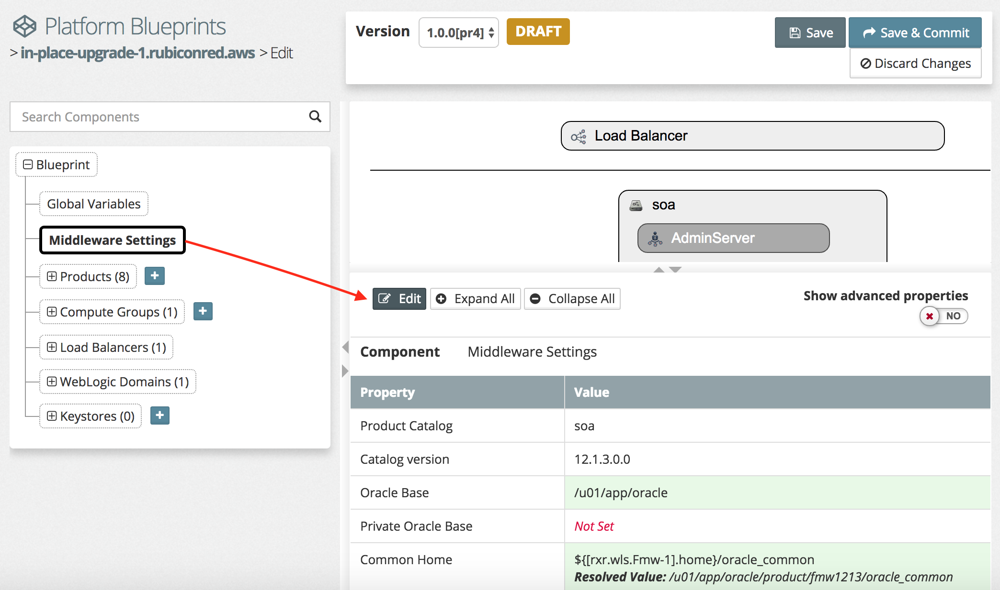
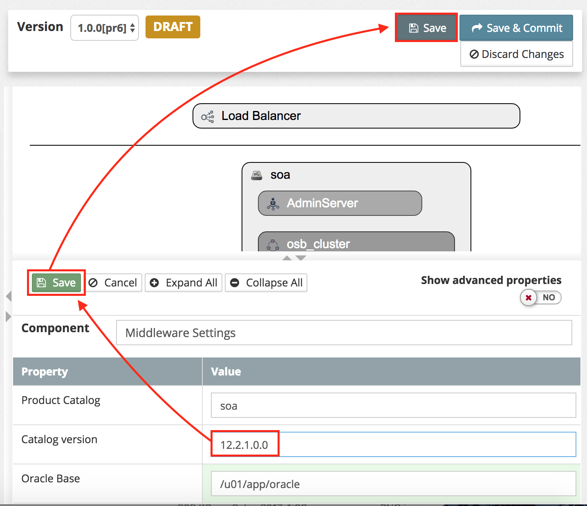
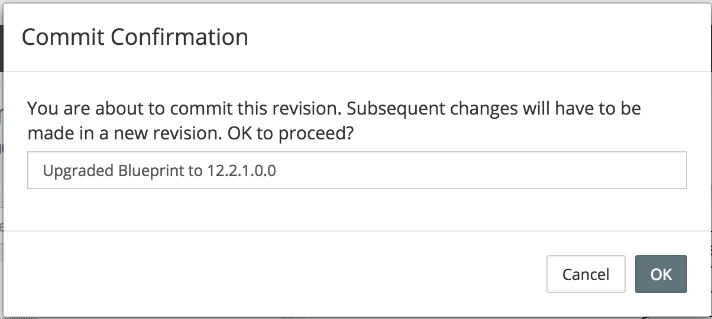

## {{ page.title }}

In order to get the latest bug fixes and feature enhancements from your Oracle product investments you will likely wish to upgrade them on a regularly to semi-regular basis. Fundamental there is two types of upgrades.

 * **One-off patches**: These are provided by Oracle and available for download from [My Oracle Support](http://support.oracle.com) to fix a specific defect or add a minor enhancement.  One-off patches can be applied directly through MyST by first [defining them within a Platform Blueprint](/platform/resources/weblogic/patches/README.md) then [applying them to a Platform Instance](/platform/management/README.md).
<!-- TODO: The above link should ideally go to the patching sub-section -->

 * **Upgrades**: An upgrade will introduce a significant number of bug fixes and major enhancements in one hit. Without MyST an upgrade is usually resource intensive and risky. With MyST an upgrade can be automated which significantly de-risks the upgrade process. This guide primarily focuses on this type of upgrade. Upgrades can be be either:
  * **Side-by-Side**: also known as *Out-of-place* or *Blue/Green* 
  * or **Direct**: also known as *In-place*

### Side-By-Side Upgrades 
 
Most organizations, when migrating to Oracle SOA 12c or Oracle BPM 12c, choose to perform a side-by-side upgrade as it:

* requires zero downtime
* supports all SOA and BPM components
* allows for a phased migration
* involves significantly less risk 

This involves provisioning a new instance of SOA/BPM 12c, replicating the configurations from your 11g platform and migrating and deploying your code. Once ready, you then switch over from 11g to 12c. 

Most organizations fail to maintain accurate documentation of their current 11g configurations, so have to manually reverse-engineer their existing 11g production configurations so they can be re-applied to their new 12c environments. This is both a time consuming and error prone approach.

Rubicon Red MyST provides a simple and automated process for side-by-side upgrades. MyST allows you to introspect an existing 11g environment, extract the key configuration information and then use this to automatically provision an equivalent 12c environment in minutes.

#### Side-By-Side Upgrades made Simple
When performing a side-by-side upgrade, you simply point MyST at an existing environment, MyST will introspect the platform instance and create a corresponding 11g Platform Blueprint.

Next, just specify the Oracle Middleware version required. MyST will automatically convert the blueprint to one that is compliant with the Oracle Enterprise Deployment Guide whilst preserving your custom configurations.

Finally, specify the target environment(s), for the new upgraded domain. Then at the click of a button, MyST will automatically provision an equivalent upgraded Oracle Middleware platform.

The end-to-end process consists of three simple steps and can be performed in minutes as shown below.


Although this example is for an 11g to 12c upgrade, the approach would be consistent for alternative version upgrades such as an upgrade from 12.1.3.0.0 to 12.2.1.0.0 or from 12.2.1.0.0 to 12.2.1.1.0.


##### Step 1 - Introspect SOA / BPM 11gR1 Domain
For the purpose of this guide, we are going to introspect an existing Oracle SOA 11.1.1.7 environment running on two VMs, that consists of a 2 node SOA Cluster and 2 node OSB Cluster.

The steps for introspecting an existing Oracle SOA or BPM environment are documented in the chapter - [Creating a Platform Blueprint from an Existing WebLogic Domain](/platform/introspection/README.md).


Introspection is only required if you environment to be upgraded was provisioned outside of MyST (e.g. by manual installation or another alternative method). If you built the environment with MyST, you simple upgrade the Blueprint (as shown in the next step) rather than introspecting it first.


##### Step 2 - Upgrade 11g Platform Blueprint to 12c
The next step is to upgrade our 11g SOA Platform Blueprint to create a new SOA 12c Platform Blueprint. From the side menu navigate to `Modeling` > `Platform Blueprint`, this will display a list of existing Platform Blueprints. Click on `Create New` in the top right-hand corner of the screen. This will launch the `New Platform Blueprint` wizard.

In the initial dialogue we need to specify the following details about our Platform Blueprint:

* **Name** - Shorthand name for the Platform Blueprint.  
* **Description** - A longer description of the Platform Blueprint.  
* **Workspaces** - This defines the Workspaces to which the Platform Blueprint belongs (Role Based Access Control allows us to manage which workspaces a user has access to.) 
* **Initial Version** - Specifies the initial version of the Platform Blueprint, we will stick with the default.

Finally, we need to specify how we want to create the Platform Blueprint, select the option to `Upgrade` from an existing blueprint and click `Next`.

###### Specify Oracle Middleware Upgrade Version

Next, we need to specify the Platform Blueprint that we want to upgrade, so from the drop down select the introspected Platform Blueprint; `Oracle SOA 11.1.1.7` in our example.

Next, we need to select the version of Oracle SOA 12c we want to upgrade to, in our example we will upgrade to `12.2.1.0.0`.  Once done, click `Next`.

###### Review the Summary

MyST will display a Summary screen showing a summary of the Platform Blueprint we want to upgrade and the new Platform Blueprint that it will create in the process.

We can review these details. Once done, click `Finish`. 

###### View/Edit Platform Blueprint

MyST will automatically convert our 11gR1 SOA Platform blueprint to an equivalent SOA 12c Platform Blueprint whilst preserving the custom configurations that were previously applied to our 11g environment. This includes configurations such as JDBC Data Sources, File Stores, JMS Servers, JMS Modules, JCA Adapters and SAF Agents.

Once created, MyST will open the [Platform Blueprint Editor](/platform/definitions/editor/README.md) where you can make any additional configuration changes; for example, we may want to add in the Enterprise Scheduler Service that wasn't included in 11gR1. 

If we look closely at our 12c Platform Blueprint, we can see that the number of Data Sources is different. In our 11g Platform Blueprint we had 12 JDBC Data Sources, but in our 12c Platform Blueprint we have 15 JDBC Data Sources (see box **1** outlined in red above). This is because in SOA 12c there have been changes to database schemas and corresponding JDBC Data Sources required by the Oracle SOA Platform.

When upgrading to 12c, MyST has the knowledge to remove the no longer needed 11g data sources, and create the additional ones required for 12c. If we look more closely, we will see MyST has preserved our three custom data sources, which are colored white (as opposed to light green).

In addition, we can see that when the SOA 11gR1 domain was originally created, the middleware version number was specified as part of the Domain Name as its still set to `acme11g_domain`. The corresponding directory locations `Domain Home`, `Domain Aserver Home`, etc, also have this in their file path (see box **2** outlined in red above).

To change this, place the Platform Blueprint into `Edit` mode and update the WebLogic Domain name to `acme12c_domain` and click `Save`.

We can see that MyST automatically updates all the other values that reference this property.

With this minor edit, we are now ready to provision our new 12c environment. Typically when migrating to 12c, we will want to create multiple non-Productions, such as DEV, SIT, PRE-PROD and PROD to test and validate that the migrated code is performing as expected before promoting into Production.

With MyST we can use the same Platform Blueprint to provision all these environments, ensuring each environment is consistent with Production. For each environment we want to provision, we need to create a Platform Model. This essentially maps the Platform Blueprint to the target infrastructure and captures environment specific configuration details, such as credentials.

##### Step 3 - Create Platform Model and Provision
Once we have finalized our migrated Platform Blueprint, the next step is to create a Platform Model and then use that to provision a Platform Instance. For more details on how to do this see [Chapter 3.2 - Creating a Platform Model](/platform/models/README.md).

### Direct Upgrades 

A Direct Upgrade involves taking an existing platform including all of its configuration and migrating it directly. It does not have the many benefits of a Side-by-Side Upgrade and it will require a a longer outage.

#### When to do a Direct Upgrade

As a general rule, Side-by-Side Upgrades are the safest and simplest type of upgrade to execute. However, there are some circumstances where a Direct Upgrade may be the only option.

1. When we are unable to do a Side-by-Side upgrade due to unavailablity of hardware resources to support it.
2. When we have a lot of model-specific settings in MyST Studio and want to avoid re-creating the Platform Models
3. When our application is architected in a way that we are unable to do a side-by-side upgrade.

#### When not to do a Direct Upgrade

We should avoid doing a Direct Upgrade 

1. When we want to be able to rollback immediately in the event of a failure.
2. When we want to minimise downtime or avoid a downtime altogether.

#### Types of Direct Upgrades

There is two types of Direct Upgrades

 * **Fresh**: This involves terminating the current instance and then re-provisioning  it on the new version. It is the safest type of Direct Upgrade as it relies on a standard Oracle installation rather than the in-place upgrade tools from Oracle which are less reliable and do not work in all cases. 
 * **State-preserving**: This is the riskiest type of upgrade but it has the benefit of preserving the long running state of existing deployed applications. If you want to perform a State-preserving upgrade with MyST we would recommend [raising a support ticket](http://support.rubiconred.com).

#### Direct Upgrades made Simple

Before performing a fresh direct upgrade with MyST you will need an existing Platform Blueprint and one or more Platform Models based off that.

If you do not have a Platform Blueprint and Models for your existing environments you can [introspect them using MyST](/platform/introspection/README.md).

When performing a fresh direct upgrade for a platform instance, you simply terminate the instance, update the version number within the Platform Blueprint then re-provision the instance.

The end-to-end process consists of two simple steps and can be performed in minutes.

For the purpose of this guide, we are going to upgrade an existing Oracle Service Bus 12.1.3 environment to 12.2.1 using a fresh direct upgrade approach.


Although this example is for a 12.1.3 to 12.2.1 upgrade, the approach would be consistent for alternative version upgrades such as an upgrade of 11.1.1.7.0 to 12.1.3.0.0 or from 12.2.1.0.0 to 12.2.1.1.0.


#### Step 1 - Upgrade 12.1.3.0.0 Platform Blueprint to 12.2.1.0.0

##### Specify Oracle Middleware Upgrade Version

From the [Blueprint Editor](/platform/definitions/editor/README.md) click `Edit Configuration`. Then, navigate to the `Middleware Settings` and click `Edit` in the Property Panel.

Change the version to `12.2.1.0.0` (or another version of you choice) and click `Save` in the Property Panel then `Save` for the Blueprint.

##### View/Edit Platform Blueprint

MyST will automatically convert our 12.1.3 Platform Blueprint to an equivalent 12.2.1 Platform Blueprint whilst preserving the custom configurations that were previously applied to our environment. This includes configurations such as JDBC Data Sources, File Stores, JMS Servers, JMS Modules, JCA Adapters and SAF Agents.

If we look closely at our Platform Blueprint, we can see that there is some subtle differences. For example, if we are using the default Fusion Middleware Home Directory of `/u01/app/oracle/product/fmw1213` we will see that it has changed to `/u01/app/oracle/product/fmw1221`. 


Warning

> If you are you using a custom `Home Directory` under `Middleware Settings` you must change this to be unique before performing an upgrade. For example, if it is set to `/opt/my-company/12.1.3.0.0/soa` you should change it to `/opt/my-company/12.2.1.0.0/soa`. Remember, you can use a reference to the version `${[rxr.wls.Fmw-1].version}` e.g. `/opt/my-company/${[rxr.wls.Fmw-1].version}/soa`. If you were already using this property reference then it would have changed the path automatically and you don't need to do anything. Once the property reference is set within the `Home Directory` you can be sure it will update automatically for future upgrades. Make sure that any other property references to the version in the configuration which are hardcoded are using a reference, whilst it may not cause the upgrade to fail it will be a source of confusion for the upgraded platform. 
 
Once you are happy with the upgraded Platform Blueprint click on `Save & Commit`. When prompted, enter a description for the change.

With these minor edits, we are now ready to upgrade our environments. Typically when upgrading, we will want to create multiple non-Productions, such as DEV, SIT, PRE-PROD and PROD to test and validate that the migrated code is performing as expected before promoting into Production. With MyST we can use the same Platform Blueprint to upgrade all these environments, ensuring each environment is consistent with Production.

#### Step 2 - Terminate and Re-provision the existing environment

From the `Actions` menu for any Platform Instance there is the option to `Terminate`. This will destroy the WebLogic Domain on the file system to allow for it to be upgrade. This approach is described in more detail in the section on [Managing Platform Instances](/platform/management/README.md).


Warning

> 
Please be aware when this is performed you will loose any existing application state. Do not use this approach for an application architecture with long running processes. In this case, it is advisable to perform a State-preserving Upgrade which can be facilitated by raising a request to [MyST Support](http://support.rubiconred.com).

When ready to do a fresh direct upgrade to an instance associated with the upgraded Platform Blueprint, simply trigger the `Terminate` then perform a `Reprovision`.

